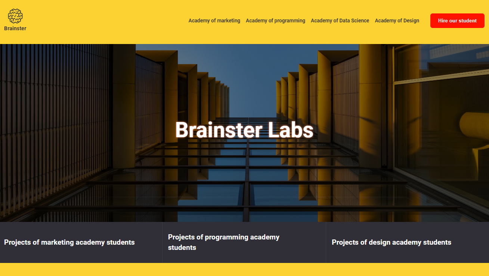

# BrainsterProjects_NenadShkurtevskiFE11

# Brainster Labs Website

The Brainster Labs website is a responsive webpage that showcases the various academies that Brainster offers, including Marketing Academy, Programming Academy, Academy for Data Science, and Design Academy. This webpage was built using HTML, SASS, and JavaScript.

## Table of Contents

1. Features
2. Installation
3. Usage
4. Support
5. Contributing
6. Author
7.

## Features

This webpage consists of several sections:

1. Top menu (navbar) which will contain the following links:

- A logo that will lead to the index page itself
- Marketing Academy which will lead to the following link: https://brainster.co/marketing/
- Programming Academy which will lead to the following link: https://brainster.co/full-stack/
- Academy for data-science which will lead to the following link: https://brainster.co/data-science/
- Design Academy which will lead to the following link: https://brainster.co/graphic-design/
- "Employ our students" button that will take you to a new page that is shown below.

2. Banner with image and text
3. Filters
4. Cards with projects from the academy
5. Footer

In addition to the above features, the website also includes a second page for a form for fulfillment. The form has validation fields that must be filled before the form is submitted and the form includes functionality for validation process, and the page also includes JavaScript functionality for loading more cards on the mobile version of the page.

## Installation

To use this webpage, simply clone the repository and open the index.html file in your browser.

git clone https://gitlab.com/Shkurtevski/brainsterprojects_nenadshkurtevskife11.git
cd brainsterprojects_nenadshkurtevskife11
open index.html

## Usage

Once you have the webpage open in your browser, you can use the navigation links to explore the different academies offered by Brainster. Clicking on the "Employ our students" button will take you to a new page where you can learn more about hiring Brainster students.

## Support

If you encounter any issues while using the webpage, please feel free to open an issue.

## Contributing

Contributions to this webpage are welcome! If you find a bug or have a feature request, please open an issue or submit a pull request.

## Author

This webpage was created by Nenad Shkurtevski.
